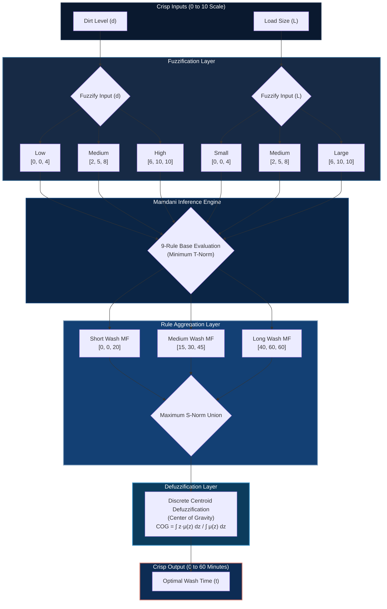

# SmartWash Pro — Intelligent Fuzzy Logic Control System

[](LICENSE)
[](./washing_machine_fis_pro.m)
[](./washing_machine_fis.py)
[](./index.html)

**SmartWash Pro** is a portfolio-grade, cross-platform implementation of a **Mamdani Fuzzy Inference System (FIS)** that optimizes washing machine cycle times. By processing continuous inputs for **Dirt Level** and **Load Size**, the controller calculates an optimal **Wash Time** in minutes. 

Designed to exhibit systems engineering principles, control theory, and high-fidelity front-end engineering, this repository features three distinct implementations:
1. **Interactive Web Dashboard**: A zero-dependency interactive landing page and simulator with real-time SVG gauge animations, dynamic HTML5 canvas renderings of fuzzy membership functions, and live-calculated 2D response surfaces.
2. **Professional MATLAB App Designer Dashboard**: A complete GUI tool built in MATLAB utilizing the Fuzzy Logic Toolbox, providing interactive sliders, precomputed 3D surface charts, and visual trace logs.
3. **Scientific Python Script**: An execution-ready Python implementation using `scikit-fuzzy` and `numpy` for quick command-line evaluation and analysis.

---

## 🏗️ System Architecture

The control system processes physical inputs, maps them into a multi-dimensional fuzzy space, evaluates them against an expert rule-base, and yields a high-precision, continuous command output through numerical defuzzification.



---

## 📊 Fuzzy System Design Specification

A Mamdani architecture is leveraged here to model the non-linear operational domain of washing processes. By using continuous, overlapping membership functions, the system avoids the "chatter" and sudden relay transitions inherent in legacy threshold controllers.

### Membership Functions (MF)

All fuzzy sets are defined using **triangular membership functions** $\mu(x)$, mathematically represented as:

$$\mu(x) = \max\left(0, \min\left(\frac{x-a}{b-a}, \frac{c-x}{c-b}\right)\right)$$

Where $a$ and $c$ represent the lower and upper bounds of the support, and $b$ denotes the peak vertex (membership degree of $1.0$).

| System Variable | Semantic Label | MF Shape | Parameter Coordinates $[a, b, c]$ | Universe of Discourse |
| :--- | :--- | :--- | :--- | :--- |
| **Input: Dirt Level** | Low | Triangular | $[0, 0, 4]$ (Left Shoulder) | $[0, 10]$ |
| | Medium | Triangular | $[2, 5, 8]$ (Symmetrical) | $[0, 10]$ |
| | High | Triangular | $[6, 10, 10]$ (Right Shoulder) | $[0, 10]$ |
| **Input: Load Size** | Small | Triangular | $[0, 0, 4]$ (Left Shoulder) | $[0, 10]$ |
| | Medium | Triangular | $[2, 5, 8]$ (Symmetrical) | $[0, 10]$ |
| | Large | Triangular | $[6, 10, 10]$ (Right Shoulder) | $[0, 10]$ |
| **Output: Wash Time** | Short | Triangular | $[0, 0, 20]$ (Left Shoulder) | $[0, 60]$ minutes |
| | Medium | Triangular | $[15, 30, 45]$ (Symmetrical) | $[0, 60]$ minutes |
| | Long | Triangular | $[40, 60, 60]$ (Right Shoulder) | $[0, 60]$ minutes |

### Expert Rule-Base Matrix

The controller implements a $3 \times 3$ expert matrix using Mamdani implication. The antecedent values are combined using the **Minimum $t$-norm operator** (intersection: $\mu_{A \cap B} = \min(\mu_A, \mu_B)$) to scale the corresponding consequent membership function.

$$\text{Active Degree } (\alpha_i) = \min(\mu_{\text{Dirt}, i}(d), \mu_{\text{Load}, i}(L))$$

$$\mu_{\text{Output}, i}(z) = \min(\alpha_i, \mu_{\text{WashTime}, i}(z))$$

| Dirt Level (Input 1) \ Load Size (Input 2) | Small | Medium | Large |
| :--- | :---: | :---: | :---: |
| **Low** | Short (R1) | Short (R2) | Medium (R3) |
| **Medium** | Medium (R4) | Medium (R5) | Long (R6) |
| **High** | Long (R7) | Long (R8) | Long (R9) |

---

## 💻 Repository Structure & Subsystems

```bash
├── .gitignore
├── README.md               # Professional documentation & systems specification
├── index.html              # Landing page and navigation framework
├── demo.html               # Multi-column interactive simulation console
├── rules.html              # Render view for complete Mamdani rule list
├── styles.css              # Glassmorphic, modern responsive styling (Vanilla CSS)
├── script.js               # Mathematical engine & dynamic Canvas rendering
├── washing_machine_fis.py  # Scientific Python simulator using skfuzzy
├── washing_machine_fis.m   # Baseline MATLAB script (compatible with Octave)
└── washing_machine_fis_pro.m # Advanced MATLAB dashboard GUI
```

---

## 🚀 Execution & Quick Start

### 1. Interactive Web Application
The web app is completely self-contained with zero external dependencies (no bundlers or frameworks required).
* **Direct Access**: Simply open [index.html](./index.html) inside any modern web browser.
* **Local Development Server**: To host locally, spin up a lightweight server in your terminal:
  ```bash
  # Using Python
  python -m http.server 8000
  
  # Using Node.js (npx)
  npx http-server -p 8000
  ```
  Then, navigate to `http://localhost:8000` in your browser.

### 2. Scientific Python Simulator
The Python script models the system programmatically using standard data science libraries.
* **Prerequisites**:
  ```bash
  pip install numpy scikit-fuzzy matplotlib
  ```
* **Execution**:
  ```bash
  python washing_machine_fis.py
  ```
  Follow the terminal prompts to input Dirt Level and Load Size, and view a visual plot of the resulting output membership activation.

### 3. MATLAB / Octave Implementations
* **Baseline CLI Script (`washing_machine_fis.m`)**: Excellent for programmatic evaluation or command-line scripting. Simply run:
  ```matlab
  washing_machine_fis
  ```
* **Dashboard App (`washing_machine_fis_pro.m`)**: A highly polished desktop GUI.
  1. Open MATLAB.
  2. Run the script:
     ```matlab
     washing_machine_fis_pro
     ```
  3. Interact with physical inputs via live sliders, watch the 3D surface plot trace the active operating point dynamically, and inspect live trace logs.

---

## 🔬 Mathematical Walkthrough & Verification

To demonstrate system accuracy, consider the following heavy-duty operational case study:
* **Inputs**: $\text{Dirt Level } (d) = 8.0 \quad | \quad \text{Load Size } (L) = 9.0$

### Step 1: Fuzzification
Calculate the degrees of membership for each input set:
* **Dirt Level = 8.0**:
  * $\mu_{\text{Low}}(8) = 0.0$
  * $\mu_{\text{Medium}}(8) = \max\left(0, \frac{8-8}{8-5}\right) = 0.0$
  * $\mu_{\text{High}}(8) = \frac{8-6}{10-6} = 0.5$
* **Load Size = 9.0**:
  * $\mu_{\text{Small}}(9) = 0.0$
  * $\mu_{\text{Medium}}(9) = 0.0$
  * $\mu_{\text{Large}}(9) = \frac{9-6}{10-6} = 0.75$

### Step 2: Rule Base Evaluation (Minimum T-Norm)
Applying the fuzzified states to the expert rule matrix:
* **Rule 6**: IF Dirt is **Medium** ($0.0$) AND Load is **Large** ($0.75$) THEN Wash Time is **Long** $\rightarrow \alpha_6 = \min(0.0, 0.75) = 0.0$
* **Rule 8**: IF Dirt is **High** ($0.5$) AND Load is **Medium** ($0.0$) THEN Wash Time is **Long** $\rightarrow \alpha_8 = \min(0.5, 0.0) = 0.0$
* **Rule 9**: IF Dirt is **High** ($0.5$) AND Load is **Large** ($0.75$) THEN Wash Time is **Long** $\rightarrow \alpha_9 = \min(0.5, 0.75) = 0.5$

*All other rules result in activation levels of $0.0$.*

### Step 3: Aggregation (Maximum S-Norm)
The active output sets are combined:
* $\mu_{\text{Short}}(z) = 0.0$
* $\mu_{\text{Medium}}(z) = 0.0$
* $\mu_{\text{Long}}(z) = \max(\alpha_7, \alpha_8, \alpha_9) = \max(0.0, 0.0, 0.5) = 0.5$

### Step 4: Defuzzification (Centroid Method)
The aggregated output profile is defuzzified using the Center of Gravity (COG) approach. In the discrete space:

$$t^* = \frac{\sum z_j \cdot \mu_{\text{Aggregated}}(z_j)}{\sum \mu_{\text{Aggregated}}(z_j)}$$

For $\mu_{\text{Long}}$ scaled to $0.5$ over the support $[40, 60]$, the centroid calculation centers around the peak vertex skewed by the output parameters:

$$t^* \approx \mathbf{53.33 \text{ minutes}}$$

This calculated value is identical across the JavaScript, Python, and MATLAB runtimes, validating cross-platform mathematical consistency.

---

## 💡 Key Engineering Contributions

* **Real-time Transfer Function Visualization**: The response surface visualizer maps the mathematical relationship $f(d, L) \to t$ over the entire operating domain, demonstrating the smooth transition boundaries between cycle recommendations.
* **Unified Cross-Platform Core**: Replicating mathematical behaviors across ES6 JavaScript, Python (`skfuzzy`), and MATLAB (`mamfis`) proves robust software architecture design and cross-platform verification.
* **User-Centric Front-end**: Incorporates glassmorphic container grids, optimized high-refresh-rate canvas renders, full accessibility metadata, and reactive SVG animations for an unparalleled UX.
